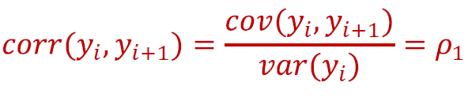

# **SERIELES TEMPORALES**
## Procedimiento

### **1º Análisis de las características de la serie. (Usados Datadet --> Ventas de tractores)**

vamos a tener que tener en cuenta:

- Tendencia
- Periodicidad
- Heterocedasticidad
- Ciclo estacional 

Lo cual podemos verlo en estas dos gráficas:
Para el **BOXPLOT** debemos de utilizar el siguiente código:
```R
boxplot(ventas_ts ~ cycle(ventas_ts), ylab = 'Ventas', xlab = 'Periodos')
```


Para la gráfica **Original** debemos de utilizar el siguiente código:
```R
autoplot(ventas_ts) + 
  labs(title = 'Numero de tractores vendidos entre 2003 y 2014', y = 'Ventas', x = 'Años')
```


Dentro de los análisis estadísticos de los datos, es conveniente, **descomponer** la serie temporal par una visualización más intuitiva, podemos hacerlo siguiendo dos modelos:

- Multiplicativo -->**Y[t]=T[t] x S[t] x e[t]**
- Aditivo -->**Y[t]=T[t] + S[t] + e[t]**

Siendo:
- T[t]: Tendencia
- S[t]: Estacionalidad 
- e[t]: Error o componente irregular

El criterio en el que debemos basarnos en el tipo de modelo es, evaluar si la variabilidad o la volatilidad de las observaciones crece exponencialmente con la tendencia y si los datos presentan ciclo estacionalç

Para ello utilizaremos el siguiente código, teniendo en cuenta que debemos de cambiar el *Type* ya sea multiplicativo (*multiplicative*) o aditivo (*aditive*):

```r
autoplot(decompose(ventas_ts, type = "multiplicative")) 
            + labs(title = 'Descomposicion de la serie temporal ventas')
```


### **2º Conversión a estacionaria**
La condición de estacionareidad se cumple en aquellas series que no tienen tendencia ni ciclo estacional, y que su varianza es constante a lo largo del tiempo (homocedasticidad).

#### **Diferencias regulares.**

Este tipo de diferencias son usadas para la eliminación de la tendencia en la serie temporal, debemos de utilizar tantas diferencias como sean necesarias hasta que obsevemos gráficamente que nuestra serie no tiene tendencia.

```r
autoplot(diff(ventas_ts, lag = 1)) + 
  labs(y = 'Diferencia regular de orden 1 en ventas_ts', x ="Años")
```


Como podemos observar, ha desaparecido la tendencia. En el caso de que esta siguiese estando presente deberíamos realizar una segunda diferencia (*También llamado de oreden 2*)

```r
autoplot(diff(diff(ventas_ts, lag = 1), lag = 1)) + 
  labs(y = 'Diferencia regular de orden 2 en ventas_ts', x = "Años")
```
#### **Diferencias estacionales.**

Este tipo de diferencias se usa para eliminar la estacionalidad en la serie. 
Una serie presenta ciclo estacional cuando año tras año, se repite el mismo comportamiento o patrón, en la misma epoca del año.

```r
autoplot(diff(diferencia_1, lag = frequency(ventas_ts))) 
    + labs(y = 'Diferencia regular de orden 1 y estacional', x = "Años")
```


Donde: 
> frequency(ventas_ts)

En este caso, su valor es 12, que hace referencia al numero de periodos por año, o frecuencia de la serie temporal. 

| Frecuencia  | Periodos  |  
|---|---|
| Mensual  | 12 |  
| Trimestral |  4 | 
| Cuatrimestral  | 3  | 
| Semestral  | 2  | 
| Anual  | 1  | 

#### **Homocedasticidad.**

Para convertir una serie a homocedastica, debemos estabilizar su varianza, mediante la transformacion BOX COX. EN R, al escribir la funcion box cox,debemos tener en cuenta que se pone delante de las diferencias regulares y estacional.

```r
lambda <- BoxCox.lambda(ventas_ts)
autoplot(diff(diff(BoxCox(ventas_ts, lambda = lambda), lag = 1), lag = 12)) 
    + labs(y = 'Transformacion BOXCOX de ventas con diferencias', x = "Años")
```


Donde: 
> BoxCox.lambda(ventas_ts)

Lambda hace referencia al coeficiente necesario para realizar la conversion de la serie a homocedastica.


### **3º Analisis de autocorrelacion: FAS Y FAP**

Es necesario conocer cómo influyen las observaciones del pasado en el futuro para analizar y modelar la serie, es por eso que se usan la FAS Y la FAP (funciones de **autocorrelacion** simple y parcial).

Es de vital importancia, para poder hacer los analisis de autocorrelacion, que la serie haya sido convertida a **estacionaria** (Paso 2º).

Los resultados de los análisis de autocorrelacion simple y parcial van a dictaminar la estructura de los modelos que mejor se ajustan a la serie temporales, es decir, los modelos ARIMA candidatos a explicar el comportamiento de la siere y con lo que haremos las predicciones.

**Función de Autocorrelación Simple (FAS):**

Esta función proporciona la estructura de dependencia lineal de la serie. Lo que significa que estudia la relacion que hay ente una observación pasada y la observación objeto de analisis. Es decir: 


Siendo p(1):



Para obtener el grafico de la FAS en R:

```r
ggAcf(diff(diff(ventas_ts, lag = 1), lag = 12), lag.max = 24) + 
  labs(title = 'FAS de la serie ventas con diff regular y estacional')
```

De este gráfico podemos obtener ciertas componentes de las estructuras regular y estacional del modelo ARIMA.

**Función de Autocorrelación Parcial (FAP):**

Proporciona la relación directa existente entre observaciones separadas por retardos. Es decir, para el cálculo de la FAP, se tiene en cuenta los valores de los retardos intermedios.

Explicado de otra manera, para estudiar como afecta una observacion pasada a la observacion objeto de analisis, no solo se tienen en cuenta esas dos observaciones, sino todas las sucedaneas entre la obs pasada y la obs a analizar. (Si queremos estudiar la relacion entre y4 e y1, tendremos en cuenta tambien la relacion entre y1-y2-y3)


```r
ggPacf(diff(diff(ventas_ts, lag = 1), lag = 12), lag.max = 24) + 
  labs(title = 'FAP de la serie ventas con diff regular y estacional')
```


De este gráfico también podemos obtener ciertas componentes de las estructuras regular y estacional del modelo ARIMA, pero en este caso la **p y la P**.
### **4º MODELOS ARMA Y ARIMA**

Para modelar un proceso estacionario, usamos técnicas basadas en modelos ARMA y ARIMA: “Autoregressive Moving Average” y
“Autoregressive Integrated Moving Average”.

Si la serie temporal no es estacionaria, primero se debe convertir dicho componente en estacionario (sin tendencia, sin ciclo estacional y homocedastico), se predice dicho componente y, finalmente, se deshace la conversión para recuperar la predicción de interés.

**Procesos Autorregresivos: AR(p)**

En fucnion de los elementos significativos del grafico de la FAP, determinaremos el orden del proceso autorregresivo (**p**). Por lo que podriamos determinar con ello ciertos componentes de los modelos ARIMA:
- ***Estructura regular ARIMA (p,d,q)***: De la FAP obtenemos la **p**, que viene dada por el orden del **PROCESO AUTORREGRESIVO** empleado. Para determinar el orden **p** del proceso AR, debemos fijarnos en si los primeros periodos de la gráfica son **significativos o no**. Serán significativos cuando soprepasen el intervalo de cofianza generado automaticamente por el grafico de FAS. Los valores frecuentes de q son 0,1,2,3.

- ***Estructura estacional ARIMA(P,D,Q)s:*** Tambien podemos determinar la **P**, obtenemos su valor fijandonos en la **significatividad** de los periodos equivalentes a un año, debemos fijarnos en los periodos **12 y 24**). Los valores más frecuentes de Q son 0,1,2. 

*(Ejemplo de la estructura de la FAP con 1 elemento significativo):*


**Procesos de Media Movil: MA(q)**

Para determinar el orden de este tipo de procesos de memoria corta, nos fijaremos en la FAS. Es decir, en fucnion de los elementos significativos del grafico de la FAS, determinaremos el orden del proceso media movil (**q**).

- ***Estructura regular ARIMA (p,d,q)***: De la FAS obtenemos la **q**, que viene dada por el orden del **PROCESO MEDIA MOVIL** empleado. Para determinar el orden **q** del proceso MA, debemos fijarnos en si los primeros periodos de la gráfica son **significativos o no**. Serán significativos cuando soprepasen el intervalo de cofianza generado automaticamente por el grafico de FAS. Los valores frecuentes de q son 0,1,2,3.

- ***Estructura estacional ARIMA(P,D,Q)s:*** Tambien podemos determinar la **Q**, obtenemos su valor fijandonos en la **significatividad** de los periodos equivalentes a un año (en este caso, que nuestra serie tiene periodicidad mensual (n = 12), debemos fijarnos en los periodos **12 y 24**). Los valores más frecuentes de Q son 0,1,2.

*(Ejemplo de la estructura de la FAS con 1 elemento significativo):*


**MODELOS ARMA**: (menos usados)

Los procesos ARMA(p, q) son una combinación de
estructuras autorregresivas y de media móvil y tienen una
parte AR(p) y una parte MA(q). Pero estos no sirven para modelar series temporales de caracter **estacionario**, para ello usamos los modelos ARIMA.

**MODELOS ARIMA**:

Los procesos ARIMA eliminan la tendencia de una serie
diferenciándola **d** veces. Típicamente, = 1, 2.

Este parametro "d" para la estructura **regular del modelo ARIMA,(p,d,q)** viene determinado por el numero de diferencias que apliquemos para eliminar la tendencia. Por lo que, este parametro y los explicados previamente (**p del proceso AR y q del proceso MA**), conforman la estructura regular del modelo ARIMA candidato a ser el modelo que mejor se ajuste a la serie temporal objeto de analisis.

Mientras que el parametro "D" de la estructura **estacional del modelo ARIMA, (P,D,Q)** viene dado por la aplicación de una diferencia estacional (orden 12, 4..., dependiendo de la periodicidad). 

Los valores más frecuentes de **D** son 0,1, dependiendo de si es necesario eliminar el ciclo estacional de la serie o no. 

Con este ultimo parámetro ya podemos construir los modelos ARIMA (p,d,q)x(P,D,Q) candidatos a estimar las predicciones futuras de una serie temporal. 

```r
ARIMA111x010 <- arima(ventas_ts, order = c(1,1,1), seasonal = list(order = c(0,1,0)))

autoplot(acf(ARIMA111x010$residuals)) + labs(title = 'FAS de los residuos del modelo ARIMA111x010')
# ó
ggAcf(ARIMA111x010$residuals) + labs(title = 'FAS de los residuos del modelo ARIMA111x010')
```
> Donde *order =* es la estructura regular y *seasonal =* la estacional.

Lo que se genera por consola al crear el modelo es una lista con la siguiente informacion: 


### **5º Seleccion del modelo optimo para la prediccion**

Para determinar que modelo de los candidatos es el más adecuado para la prediccion, **debemos asegurarnos de que los residuos de dicho modelo NO estan correlacionados entre si**. O lo que es lo mismo, que **LA FAS DE SUS RESIDUOS ES RUIDO BLANCO** (0 VALORES SIGNIFICATIVOS EN LA FAS DE LOS RESIDUOS DEL MODELO).

*(Ejemplo de una FAS de los residuos de un modelo candidato)*: No ruido blanco.


En el caso de que exista mas de un modelo ruido blanco, o que ninguno de los candidatos lo sea, podemos compararlos segun otro criterio: **El criterio de información de Akaike (AIC), donde
el mejor modelo ajustado tiene el menor AIC.** 

```r
AIC(ARIMA111x010, ARIMA011x010, ARIMA110x010)
```


*(Aunque tambien se puede ver en lo que devuelve por consola cada modelo por separado).*

Otros métodos de diagnosis del modelo (aparte de la FAS de los resiudos y del coeficiente AIC), son:

- El **test de Box-Pierce**, que proporciona información sobre si el primer valor de la función de autocorrelación de los residuos son cero. Este test indica problemas cuando el p-valor es bajo, por ejemplo menor que 0.05. Cuanto mayor el sea p-valor, hay más evidencia a favor de que los residuos son ruido blanco.

```{r}
# Podemos comprobar si hemos ajustado el modelo correcto, podemos realizar una diagnosis con el test de Box-Pierce, fijandonos en el p-valor.

Box.test(ARIMA110x010$residuals, lag = 1, type = 'Box-Pierce')
```

###  **6º Elaboración de las Predicciones**
Una vez ajustado y seleccionado el o los mejores modelos, es posible utilizarlo para predecir valores futuros.

Previo a hacer las predicciones pertinentes, debemos medir el comportamiento de la predicción mediante la etapa de estimación, con la **raíz del error cuadrático medio (RMSE) y el error absoluto medio (MAE)**. Esto es una manera de comprobar que la predicción que vamos a realizar se comporta correctamente.